# CHEESEBAE 

Your frictionless experience in boutique and exotic artisan cheeses. 

## Link to app: 

#### Heroku:
https://cheesebae.herokuapp.com/ 
#### GitHub:
https://github.com/brandonrobertson23/T2A2

## Identification of the problem you are trying to solve by building this particular marketplace app. Why is it a problem that needs solving? 

The problem I am trying to solve is that there is a lack of a marketplace for boutique and exotic cheese to be bought directly by users. Up until the creation of CheeseBae, cheese has needed to be bought from a Delicatessen where they normally have a limited supply and scope of product that they keep in stock. 

 
## Description of your marketplace app (website), including: 
CheeseBae is a two-sided marketplace for the buying and selling of boutique and exotic cheeses. CheeseBae is an easy to use platform for users to indulge in their own dairy (or vegetarian friendly) cheesy goodness. 
 
#### Purpose 
The Purpose of the project is to provide a marketplace for a common household snack but in a new and unique way for the industry. 
 
#### Functionality / features 
The features on my marketplace app CheeseBae are: 
User (Buyer) and Shop Owner (Seller) account set up and saving that information to the database.

Secure online payment processing via Stripe.

A home page that lists the latest 10 items listed on the marketplace.

An explore page with filters you can select to view a specific list of different items, all items or all stores.

A contact page that lists the different ways to contact the marketplace.

An account page that lets you edit your account, create a store to start selling products or delete your account. 
 
#### Sitemap 
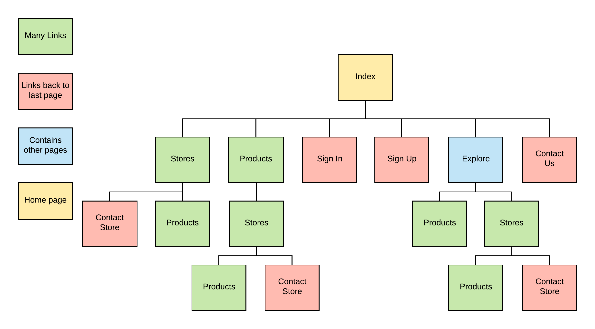 
 
#### Screenshots 
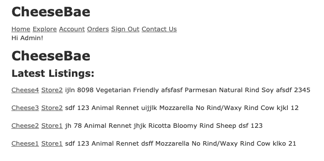
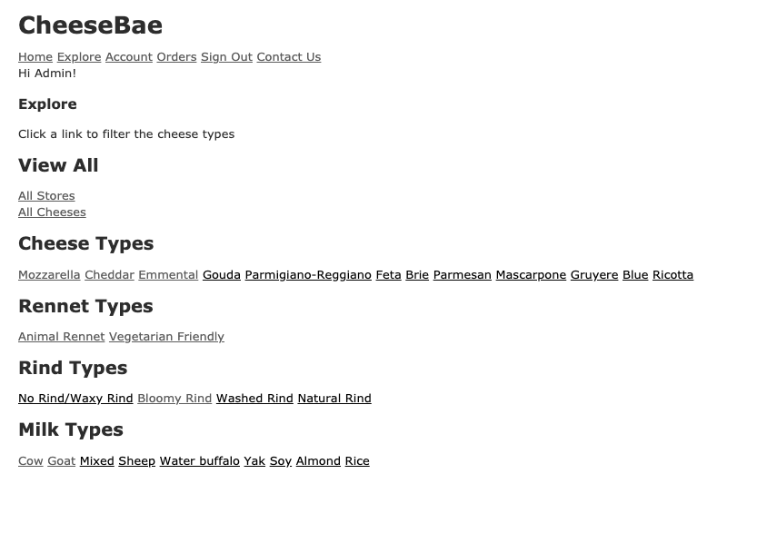
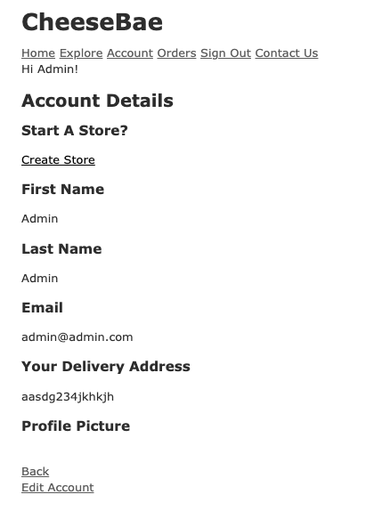
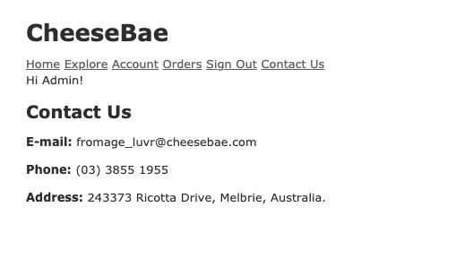
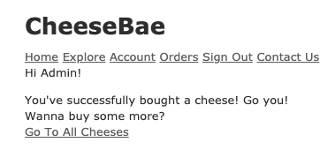
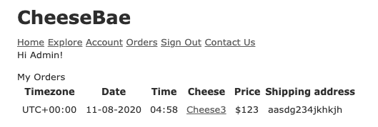
 
#### Target audience 
The target audience for CheeseBae is anyone that is a fromage connoisseur, anyone that has an interest in boutique and exotic cheeses and anyone that wants the convenience of ordering cheese straight to their door. 
 
#### Tech stack 
HTML 5 
CSS3 
Ruby on Rails (Active Storage, Active Record) 
Amazon Web Services (S3) 
Heroku (Deployment) 
Devise (Authentication) 
Cancancan (Autherisation) 
Git (Version Control) 
GitHub (Repository) 
Notion (Project Tracking) 
Balsamiq Wireframes (Wireframes) 

## User stories for your app. 
##### BUYER STORIES:
As a Buyer, I want to create an account, so that I can buy and browse on the website. 

As a Buyer, I want to pay with credit card, so I can complete a purchase. 

As a Buyer, I want to search listings, so that I can find something specific within listed items. 

As a Buyer, I want to view listed items, so that I can choose whether or not to make a purchase. 

As a Buyer, I want to receive an e-mail receipt, so that I can see the purchasing details. 

As a Buyer, I want to see information about cheese, so I can find the right type for me. 

As a Buyer, I want a user account page, so I can update my account information.

##### SELLER STORIES:
As a Seller, I want to create an account and then create a store, so that I can sell, manage my items, and browse on the website. 

As a Seller, I want to list items for sale, so that users can see and purchase my items. 

As a Seller, I want a user account page, so I can update my account information. 

As a Seller, I want to edit or delete my existing listings, so that I can change the description or remove the listing. 

As a Seller, I want to add images to the item I’m listing, so that users can see a visual representation of the item listed. 

As a Seller, I want to add a description of the item I’m listing, so that users can view a description of the item listed. 

As a Seller, I want to see what items I currently have listed for sale, so I can keep track of what I’m selling.

##### CHEESE STORIES:
As a Cheese, I want to be bought and eaten.

## Wireframes for your app. 

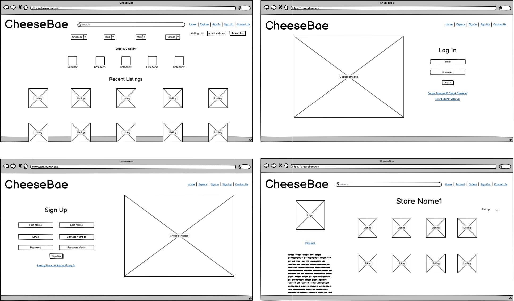
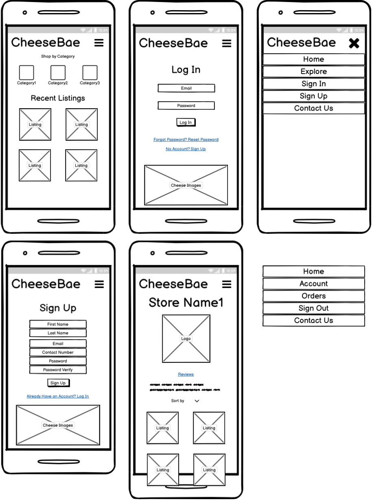

## An ERD for your app. 

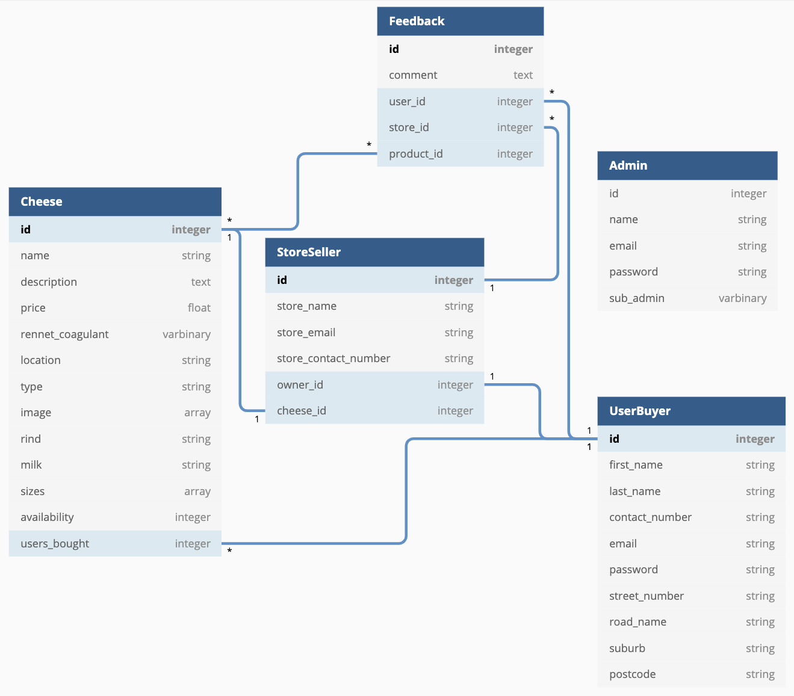  

## Explain the different high-level components (abstractions) in your app. 

In this project I have a few high-level components to handle a few low-level processes.

Active Record – This is linking the Rails Models to the Postgres database, handling the queries and table relationships.

Active Storage – This is linking the Rails Models to the local file storage/AWS online hosting.

Devise – This is used to authenticate users after they have signed up and logged in to the app.

Cancancan – This is used to authorize users after they have signed up with Devise.

Embedded Ruby Files – I use these to generate html documents via ruby code.

## Detail any third-party services that your app will use. 

In my app I use these third-party services:

Devise – For users to sign-up, login, logout and be authenticated as they move around the app.

Stripe – I have used the Stripe API to process online credit card payments.

Cancancan – Is a user authorization gem.

Heroku – I am using Heroku for deployment.

Amazon S3 – I am using AWS S3 through Active Storage to host my images. 

## Describe your projects models in terms of the relationships (active record associations) they have with each other. 

* Ability
    + This model belongs to Cancancan and helps control what Users can and can't do, it does not explicitly belong to or have anything attached to it.

* Cheese
    + has_many :orders

* Feedback
    + belongs_to :users
    + belongs_to :stores

* Order
    + belongs_to :users
    + belongs_to :cheese

* Role
    + has_and_belongs_to_many :users

* Store
    + has_many :cheeses, dependent: :destroy
    + has_many :feedbacks, dependent: :destroy
    + belongs_to :user

* User
    + has_and_belongs_to_many :roles
    + has_one :store
    + has_many :feedbacks
    + has_many :orders

## Discuss the database relations to be implemented in your application. 

Originally I had planned to implement these relations:
&nbsp;&nbsp;&nbsp;&nbsp;&nbsp;&nbsp;&nbsp;&nbsp;&nbsp;&nbsp;&nbsp;&nbsp;1. UserBuyer
&nbsp;&nbsp;&nbsp;&nbsp;&nbsp;&nbsp;&nbsp;&nbsp;&nbsp;&nbsp;&nbsp;&nbsp;2. StoreSeller
&nbsp;&nbsp;&nbsp;&nbsp;&nbsp;&nbsp;&nbsp;&nbsp;&nbsp;&nbsp;&nbsp;&nbsp;3. Cheese
&nbsp;&nbsp;&nbsp;&nbsp;&nbsp;&nbsp;&nbsp;&nbsp;&nbsp;&nbsp;&nbsp;&nbsp;4. Feedback
&nbsp;&nbsp;&nbsp;&nbsp;&nbsp;&nbsp;&nbsp;&nbsp;&nbsp;&nbsp;&nbsp;&nbsp;5. Admin

And the relationships between them were:
* UserBuyer
    + has one to many Cheese
    + has one to one StoreSeller
    + has one to many Feedback
* StoreSeller
    + has one to many Cheese
    + has one to many Feedback
* Cheese
    + has one to many Feedback
* Admin
    + Admin was it's own seperate table before I decided to add authorization through Cancancan.

## Provide your database schema design. 
An ERD for my final database schema, I will also provide a copy of the actual schema below this as it can be hard to read:
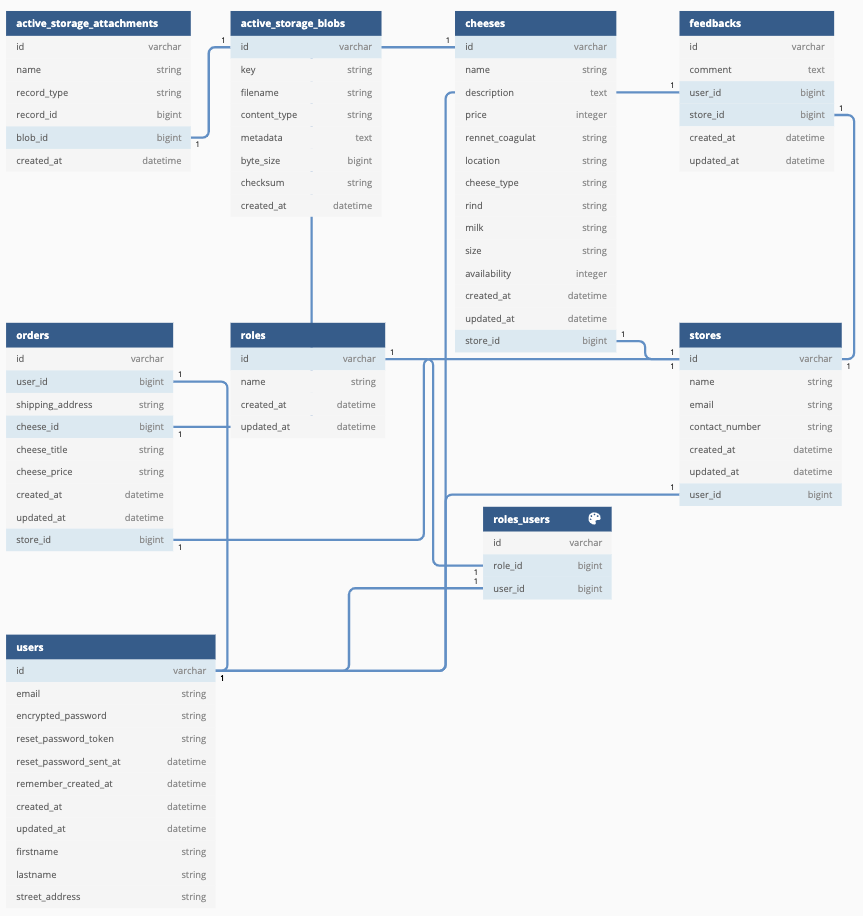

and the actual schema file:
```
ActiveRecord::Schema.define(version: 2020_08_07_022857) do

  enable_extension "plpgsql"

  create_table "active_storage_attachments", force: :cascade do |t|
    t.string "name", null: false
    t.string "record_type", null: false
    t.bigint "record_id", null: false
    t.bigint "blob_id", null: false
    t.datetime "created_at", null: false
    t.index ["blob_id"], name: "index_active_storage_attachments_on_blob_id"
    t.index ["record_type", "record_id", "name", "blob_id"], name: "index_active_storage_attachments_uniqueness", unique: true
  end

  create_table "active_storage_blobs", force: :cascade do |t|
    t.string "key", null: false
    t.string "filename", null: false
    t.string "content_type"
    t.text "metadata"
    t.bigint "byte_size", null: false
    t.string "checksum", null: false
    t.datetime "created_at", null: false
    t.index ["key"], name: "index_active_storage_blobs_on_key", unique: true
  end

  create_table "cheeses", force: :cascade do |t|
    t.string "name"
    t.text "description"
    t.integer "price"
    t.string "rennet_coagulat"
    t.string "location"
    t.string "cheese_type"
    t.string "rind"
    t.string "milk"
    t.string "size"
    t.integer "availability"
    t.datetime "created_at", precision: 6, null: false
    t.datetime "updated_at", precision: 6, null: false
    t.bigint "store_id", null: false
    t.index ["store_id"], name: "index_cheeses_on_store_id"
  end

  create_table "feedbacks", force: :cascade do |t|
    t.text "comment"
    t.bigint "user_id", null: false
    t.bigint "store_id", null: false
    t.datetime "created_at", precision: 6, null: false
    t.datetime "updated_at", precision: 6, null: false
    t.index ["store_id"], name: "index_feedbacks_on_store_id"
    t.index ["user_id"], name: "index_feedbacks_on_user_id"
  end

  create_table "orders", force: :cascade do |t|
    t.bigint "user_id", null: false
    t.string "shipping_address"
    t.bigint "cheese_id", null: false
    t.string "cheese_title"
    t.string "cheese_price"
    t.datetime "created_at", precision: 6, null: false
    t.datetime "updated_at", precision: 6, null: false
    t.bigint "store_id"
    t.index ["cheese_id"], name: "index_orders_on_cheese_id"
    t.index ["store_id"], name: "index_orders_on_store_id"
    t.index ["user_id"], name: "index_orders_on_user_id"
  end

  create_table "roles", force: :cascade do |t|
    t.string "name"
    t.datetime "created_at", precision: 6, null: false
    t.datetime "updated_at", precision: 6, null: false
  end

  create_table "roles_users", id: false, force: :cascade do |t|
    t.bigint "role_id"
    t.bigint "user_id"
    t.index ["role_id"], name: "index_roles_users_on_role_id"
    t.index ["user_id"], name: "index_roles_users_on_user_id"
  end

  create_table "stores", force: :cascade do |t|
    t.string "name"
    t.string "email"
    t.string "contact_number"
    t.datetime "created_at", precision: 6, null: false
    t.datetime "updated_at", precision: 6, null: false
    t.bigint "user_id"
    t.index ["user_id"], name: "index_stores_on_user_id"
  end

  create_table "users", force: :cascade do |t|
    t.string "email", default: "", null: false
    t.string "encrypted_password", default: "", null: false
    t.string "reset_password_token"
    t.datetime "reset_password_sent_at"
    t.datetime "remember_created_at"
    t.datetime "created_at", precision: 6, null: false
    t.datetime "updated_at", precision: 6, null: false
    t.string "firstname"
    t.string "lastname"
    t.string "street_address", null: false
    t.index ["email"], name: "index_users_on_email", unique: true
    t.index ["reset_password_token"], name: "index_users_on_reset_password_token", unique: true
  end

  add_foreign_key "active_storage_attachments", "active_storage_blobs", column: "blob_id"
  add_foreign_key "cheeses", "stores"
  add_foreign_key "feedbacks", "stores"
  add_foreign_key "feedbacks", "users"
  add_foreign_key "orders", "cheeses"
  add_foreign_key "orders", "stores"
  add_foreign_key "orders", "users"
  add_foreign_key "stores", "users"
end

```

## Describe the way tasks are allocated and tracked in your project. 

I was keeping track of my Ruby on Rails marketplace apps progress using Notion (much like Trello), before starting each day I would look over what I had done, what I had started and what I had left to do.

I would then create a daily to-do list of more specific tasks to make sure I had focused goals to achieve.
I would mark all goals by the end of the class, if the goal was not achieved in class I would take a second look later that night to make sure it was completed by the end of the day.

##### NOTION SCREENSHOTS:
###### Daily Updates
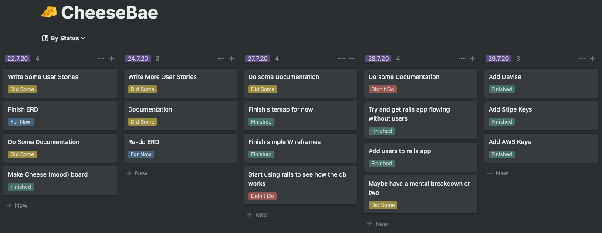
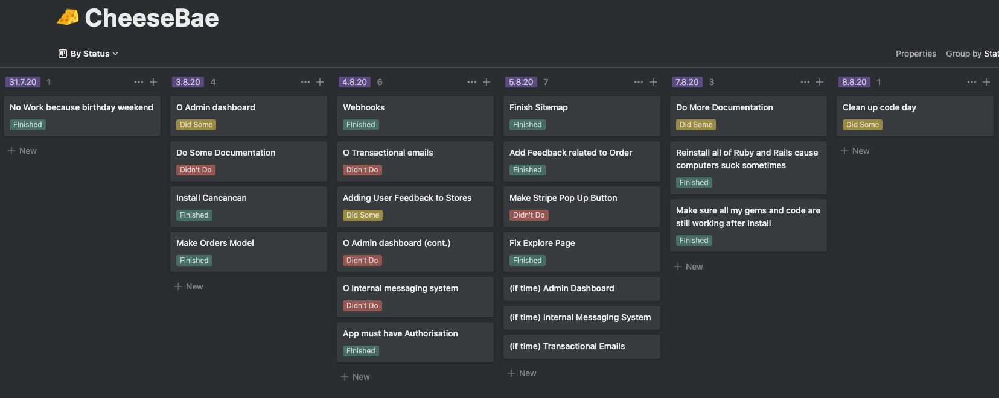
###### Requirements
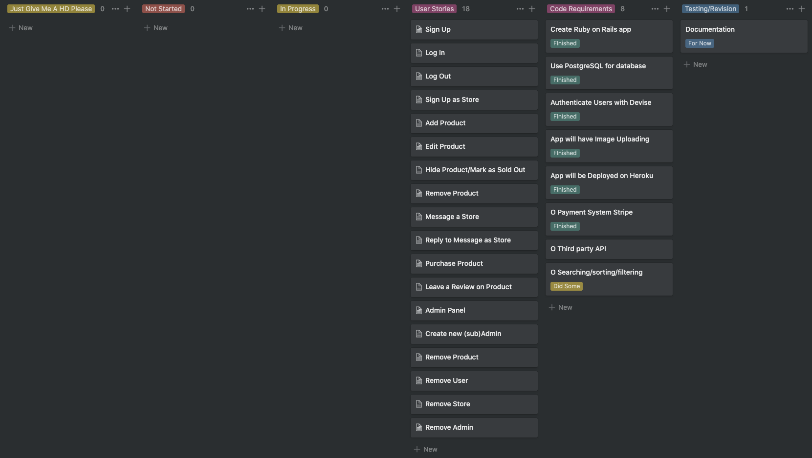
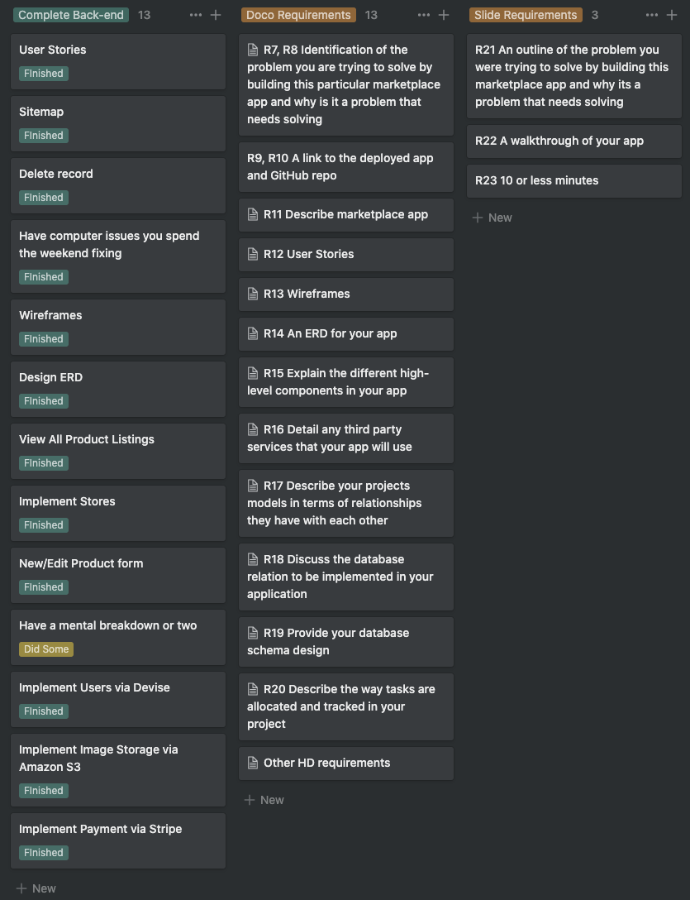